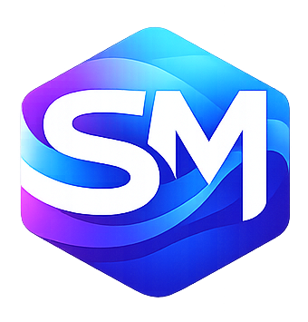
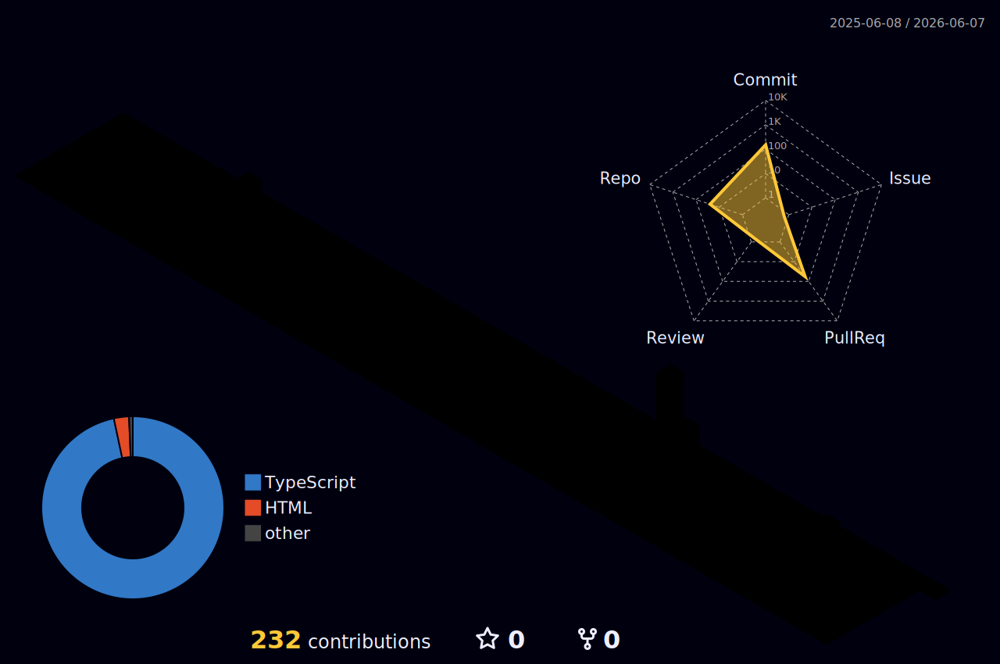

  

  

  <h1>Hi, I'm Salama Malek</h1>
  <h3>Full Stack Developer</h3>
  

  
  
  
  

  

<h2 align="center">About</h2>

  Full Stack Developer with experience building scalable web applications across frontend architecture,
  backend development, and system integration. My core stack centers on React, TypeScript, and Node.js,
  with a strong focus on performance, maintainability, and clean engineering standards.

  I work comfortably in agile environments, collaborate across design and engineering functions, and care about
  delivery quality as much as code quality. I am especially interested in modern web architecture, developer
  tooling, automation, and emerging technologies that improve how systems are built and maintained.

  
  
  
  

  

<h2 align="center">Experience Snapshot</h2>

  

    <strong>Frontend Team Leader</strong> 
    Informa Core Technologies | February 2025 - January 2026 
    Led frontend delivery for scalable web platforms, coordinated with backend teams, and shipped high-performance user-facing systems.
  

  

    <strong>Assistant Project Manager</strong> 
    ITSPORTS | November 2024 - January 2025 
    Supported project coordination, stakeholder communication, and smoother execution between technical teams and clients.
  

  

    <strong>Freelance Coach</strong> 
    EYouth | October 2024 - December 2024 
    Mentored graduates in software development, AI, freelancing, and career readiness.
  

  

<h2 align="center">Education</h2>

  

    <strong>Master's Degree - Communication & International Public Relations</strong> 
    National University of Science and Technology (MISIS) | 2023 - 2025
  

  

    <strong>Diploma - Open Source Applications Development</strong> 
    Information Technology Institute (ITI) | 2022 - 2023
  

  

<h2 align="center">Tech Stack</h2>

  <h3>Frontend</h3>
  
  
  
  
  
  
  
  
  
  
  

  <h3>Backend</h3>
  
  
  
  
  
  
  
  
  

  <h3>Database</h3>
  
  
  
  
  

  <h3>DevOps & Platforms</h3>
  
  
  
  
  
  
  
  
  

  

<h2 align="center">Tools & Environment</h2>

  
  
  
  
  

  

<h2 align="center">GitHub Stats</h2>

  
  

  

  

<h2 align="center">Contribution Universe</h2>

  <picture>
    <source media="(prefers-color-scheme: dark)" srcset="https://raw.githubusercontent.com/salama-malek/salama-malek/output/github-contribution-grid-snake-dark.svg" />
    <source media="(prefers-color-scheme: light)" srcset="https://raw.githubusercontent.com/salama-malek/salama-malek/output/github-contribution-grid-snake.svg" />
    
  </picture>

  

  These visuals are generated automatically by GitHub Actions inside this profile repository. If the snake is empty on first push, run the workflow once from the Actions tab.

  

<h2 align="center">Dynamic Activity</h2>

  

<!--START_SECTION:activity-->
1. Preparing live activity feed...
2. Push this repository and run the README activity workflow once.
3. Recent GitHub events will appear here automatically.
<!--END_SECTION:activity-->

  

<h2 align="center">Current Focus</h2>

- Building scalable backend systems that stay maintainable as complexity grows.
- Designing modern web architecture with stronger boundaries, reliability, and delivery speed.
- Creating developer tools that reduce friction and improve team productivity.
- Expanding automation across testing, integration, deployment, and day-to-day engineering work.

  

<h2 align="center">Connect</h2>

  
  
  
  
  
  
  

  +7 (993) 287-39-92 | salamahassanein@gmail.com

