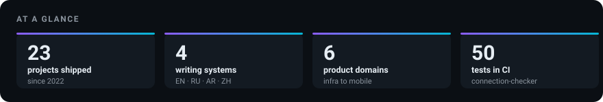
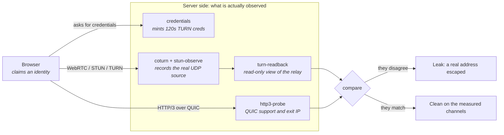
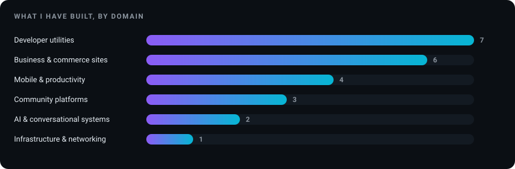
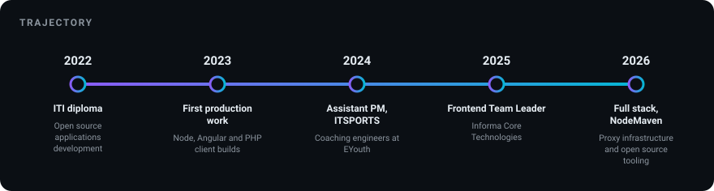

  

  <h1>Salama Malek</h1>

  
<strong>Full-stack developer</strong> · infrastructure, developer tools and multilingual products · Moscow

  

    I work on proxy and network infrastructure at <strong>NodeMaven</strong>, and I ship
    products in four writing systems. 
    The work I am proudest of measures something and then publishes what it measured,
    including the parts that did not go my way.
  

  

    
    
  

  

<!-- Portfolio and SM4TECH links removed on 2026-09-03: sm4tech.com resolves to a
     Hostinger parking page with no working TLS, and salama.sm4tech.com has no DNS
     record. Restore once the host is renewed or the domain replaced. -->

---

## Featured work

### [connection-checker](https://github.com/nodemaven/connection-checker) · open source, MIT

**Is your proxy actually hiding you?** A leak-detection tool that catches what a proxy
quietly fails to cover: WebRTC over STUN and TURN, HTTP/3 over QUIC, and addresses the
browser reports but the network contradicts.

The design rule is that **it never trusts the browser**. Every channel also has a
server-side observation, and a leak is defined as the disagreement between the two.

```mermaid
flowchart LR
    B["Browser<br/><i>claims an identity</i>"]

    subgraph SRV ["Server side: what is actually observed"]
        direction TB
        C["credentials<br/><i>mints 120s TURN creds</i>"]
        T["coturn + stun-observe<br/><i>records the real UDP source</i>"]
        R["turn-readback<br/><i>read-only view of the relay</i>"]
        H["http3-probe<br/><i>QUIC support and exit IP</i>"]
    end

    B -->|asks for credentials| C
    B -->|WebRTC / STUN / TURN| T
    B -->|HTTP/3 over QUIC| H
    T --> R
    R --> V{compare}
    H --> V
    V -->|they disagree| LEAK["Leak: a real address escaped"]
    V -->|they match| OK["Clean on the measured channels"]
```

Four containerised services behind one `docker compose up`, **50 tests across a CI
matrix**, self-hostable end to end. Observations are keyed to a random token and expire
after 120 seconds, which the README states plainly, alongside the things the tool
deliberately does **not** check. A leak-detection tool that only lists its wins is not
one you should trust.

`Python` `Flask` `coturn` `WebRTC` `QUIC` `Docker` `vanilla JS`

---

### [AI Receptionist](https://github.com/Salama-Malek/AI_RECEPTIONIST)

An AI voice receptionist that answers calls, holds a conversation, and **acts while the
call is still in progress**. The conversation module runs function-calling against a
task layer, so a call can create a record or fire a notification before it ends, then
hand off to a human when it should.

NestJS organised by domain rather than by file type: `telephony` (Twilio webhooks),
`conversation` (AI client, prompts, function calls), `tasks`, `calls`, `notifications`
(Telegram and email), `database` (Prisma over PostgreSQL). Every boundary has a
`class-validator` DTO, so malformed telephony payloads are rejected at the edge rather
than deep in a service.

`NestJS` `TypeScript` `Prisma` `PostgreSQL` `Twilio`

---

### [bible-reading-companion](https://github.com/Salama-Malek/bible-reading-companion)

My most sustained project at **68 commits**. Daily reading plans for a church youth
group, with reminders, confirmations, streak history and analytics for the leader.
Polyglot by necessity rather than fashion: TypeScript, PHP, Python and shell all earn
their place in the delivery path.

`TypeScript` `PHP` `Python` `Shell`

---

### Coptic Moscow parish platform private repository

Notification platform in **Arabic, Russian and English**, built as a monorepo. Clergy
send announcements, voice messages and live-stream alerts to the congregation.

The real constraint is not translation, it is direction: Arabic flips the layout, and
the same components have to hold in right-to-left and left-to-right without a separate
codebase. 22 commits, and the reason I will argue about bidirectional CSS.

Source is private at the parish's request, so there is no link here rather than a link
that 404s. Happy to walk through the architecture.

`TypeScript` `monorepo` `RTL`

---

### [astoria](https://github.com/Salama-Malek/astoria)

Cinematic bilingual site for a Moscow photo and print shop trading since 2010. Pure
black voids with CMYK glow accents, a printer and press that morph through the hero,
and a GSAP-pinned showcase that walks a sheet of paper through every production stage.

`TypeScript` `GSAP` `i18n`

---

## Also shipped

| Project | What it is | Stack |
|---|---|---|
| [sa-online-school](https://github.com/Salama-Malek/sa-online-school) | Online school site in Arabic, English and Russian, with persistent theme and consent state | React · Vite · Tailwind |
| [Sarah-Gerges](https://github.com/Salama-Malek/Sarah-Gerges) | Client portfolio site | TypeScript |
| [MySilentPlan](https://github.com/Salama-Malek/MySilentPlan) | Planner, goals, streaks, exercise and reading in one app | React Native · Expo |
| [moneymate-mini](https://github.com/Salama-Malek/moneymate-mini) | Lending and borrowing tracker, multi-currency, entirely on-device | React Native |
| [IntervueAI](https://github.com/Salama-Malek/IntervueAI) | AI-assisted interview practice | React · TanStack Query · Express |
| [taskflow-manager](https://github.com/Salama-Malek/taskflow-manager) | Kanban board with drag-and-drop and i18n | dnd-kit · Framer Motion |

---

## Breadth

  

Counts show range, not weight. The single infrastructure project is the one I would put
in front of an interviewer first.

### Delivery in four writing systems

Localisation is usually where a codebase's assumptions break. These shipped in more than one:

| Project | Languages | The hard part |
|---|---|---|
| Coptic Moscow private | Arabic · Russian · English | RTL and LTR sharing one component tree |
| sa-online-school | Arabic · English · Russian | Direction flip plus persisted theme and consent |
| astoria | Russian · English | Copy length changes breaking a pinned scroll animation |
| NodeMaven platform | English · Russian · Chinese | CJK metrics overflowing boxes tuned for Latin capitals |

---

## Trajectory

  

**Full-Stack Developer**, NodeMaven · 2026 to present
Proxy infrastructure and open-source measurement tooling, plus a large WordPress
platform: custom widgets, structured data, performance and trilingual delivery.

**Frontend Team Leader**, Informa Core Technologies · Feb 2025 to Jan 2026
Led frontend delivery for scalable web platforms and coordinated with backend teams.

**Assistant Project Manager**, ITSPORTS · Nov 2024 to Jan 2025 &nbsp;·&nbsp;
**Freelance Coach**, EYouth · Oct 2024 to Dec 2024

**Education**: MSc Communication and International PR, MISIS (2023–2025) · Diploma in
Open Source Applications Development, ITI (2022–2023)

---

## Stack

I have shipped in more languages than this. These are the ones I would defend in an interview:

| | |
|---|---|
| **Core** | TypeScript · React · Node.js · Python |
| **Frontend** | Next.js · Vite · Tailwind · React Native / Expo · GSAP |
| **Backend** | NestJS · Flask · Express · Prisma · PostgreSQL · MongoDB |
| **Platform** | Docker · Linux · Nginx · GitHub Actions · WordPress |

Production work also in PHP, Java and C++, and comfortable in Bash and on Red Hat,
but I would not claim those as current strengths.

---

## What I care about

- Measurement over assertion. If a tool makes a claim, the run behind it should be public.
- Documenting limits. The section listing what a tool cannot do is the one that earns trust.
- Quickstarts that actually run. A README whose first command fails costs more than a missing README.

---

  
    <a href="https://www.linkedin.com/in/salama-malek/">LinkedIn</a> ·
    <a href="mailto:salamahassanein@gmail.com">salamahassanein@gmail.com</a>
  

